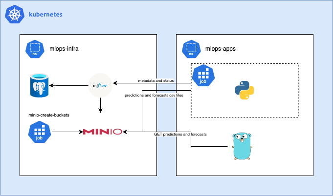

# System for training machine-learning models on daily stock prices, generating future return forecasts, and exposing them through a Go-based REST API.


### 🚀 Requirements & Local Setup

> [!Note]
> Tested and developed on Minikube v1.33.1.

Required:
- Minikube v1.33.1 (for local usage)
- Docker
- kubectl
- Python 3.11
- Go 1.22

Start the local cluster with:
```bash
./bootstrap_local.sh
```

This script initializes Kubernetes cluster, MLflow, MinIO, required namespaces and services.

---

#### 🧠 What the Model Does

The system predicts daily stock returns.

For a given ticker (e.g. AAPL) and horizon H:
- input: historical daily returns of other tickers
- output: predicted daily return of the target ticker on day t + H (business days)

> [!IMPORTANT]
> H = 7 means “return on the 7th trading day in the future”, not a 7-day cumulative return.

---

#### 🤖 Model Used

Training uses Histogram-based Gradient Boosting from scikit-learn:

👉🏼 [HistGradientBoostingRegressor / Classifier](https://scikit-learn.org/stable/modules/generated/sklearn.ensemble.HistGradientBoostingClassifier.html)

**Why this model:**
- handles non-linear relationships well
- fast on medium-sized tabular datasets
- robust to feature scaling
- suitable for time-series–derived tabular features

**The model is trained separately for:**
- each ticker (or all tickers)
- each forecast horizon (H = 1 … N)


#### 🔧 How the Pipeline Works
1.	Load daily prices from Prices.csv
2.	Generate features: daily returns ret_*
3.	Define target: future return ret_ shifted by H days
4.	Time-based split: train / validation / test
5.	Train model
6.	Save results:
  - metrics and model → MLflow
  - predictions → MinIO (CSV)

---

### Inner Cluster Flow ⁕


---

#### 📦 Outputs

MLflow

Stores:
- trained models
- validation and test metrics (MAE, RMSE)
- parameters (ticker, horizon, split dates)

Each run corresponds to:
- forecast horizon H

---

#### MinIO (S3)

Default bucket: predictions

Stored files:
- /H/predictions_test.csv
- /H/forecast_latest.csv

predictions_test.csv:
- historical evaluation results
- true vs predicted returns
- linked to MLflow run

forecast_latest.csv:
- latest available forecast
- single row per ticker and horizon
- used directly by the API

---

#### ⚙️ Configuration (Environment Variables)

Most important:
- DATA_PATH – path to Prices.csv
- TARGET_TICKER – e.g. AAPL or ALL
- HORIZON_DAYS_MAX – max forecast horizon
- TRAIN_END / VAL_END – time-based split dates

MLflow / MinIO:
- MLFLOW_TRACKING_URI
- MLFLOW_S3_ENDPOINT_URL
- PREDICTIONS_BUCKET
- AWS_ACCESS_KEY_ID / AWS_SECRET_ACCESS_KEY

Development:
- DRY_RUN=1 – validate setup without training

---

### 🔌 API Usage (Go)

Base URL:
```bash
http://localhost:8080
```
Health check:
```bash
curl http://localhost:8080/health
```

List stored artifacts:
```bash
curl http://localhost:8080/objects
```

Get test predictions:
```bash
curl “http://localhost:8080/predictions/AAPL?h=1”
```

Get latest forecasts (all horizons):
```bash
curl “http://localhost:8080/forecast/AAPL”
```

Get forecast for specific horizon:
```bash
curl “http://localhost:8080/forecast/XOM” | jq ‘.items[] | select(.h==2) | .data’
```
---

### 🧪 Interpreting Results
- Predicted returns can be positive or negative
- Negative value means the model expects a negative daily return
- pred_sign is derived automatically:
- 1 → expected positive return
- 0 → expected negative return

---
---